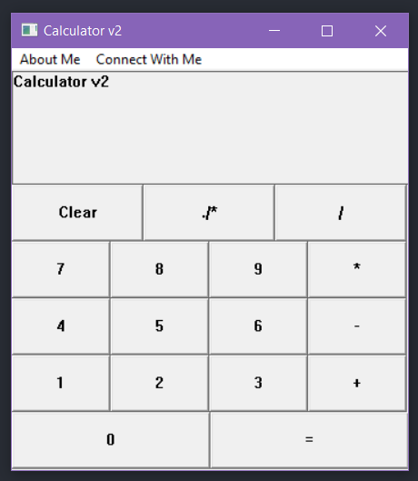

# Calculator Application  

A simple calculator application built in **C** using the **Win32 API** for the user interface. This project demonstrates basic arithmetic operations with a custom-built graphical interface.  

## Features  

- Perform basic arithmetic operations:  
  - Addition  
  - Subtraction  
  - Multiplication  
  - Division  
- Lightweight and fast  
- Custom UI built entirely using the **Win32 API**  

## Screenshot  

  

## Prerequisites  

- Windows OS (tested on Windows 10 and above)  
- A C compiler (e.g., GCC, MSVC)  

## How to Build  

1. Clone the repository or download the source files.  
2. Open a terminal and navigate to the project directory.  
3. Compile the code using your preferred compiler. For example, with GCC:  

   ```bash
   gcc -o Calculator calculator.c -Calculator
4. Run the compiled executable:  ```

   ```bash
   Calculator.exe 
